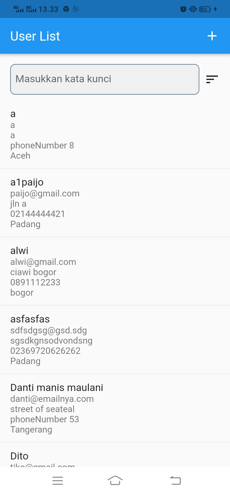
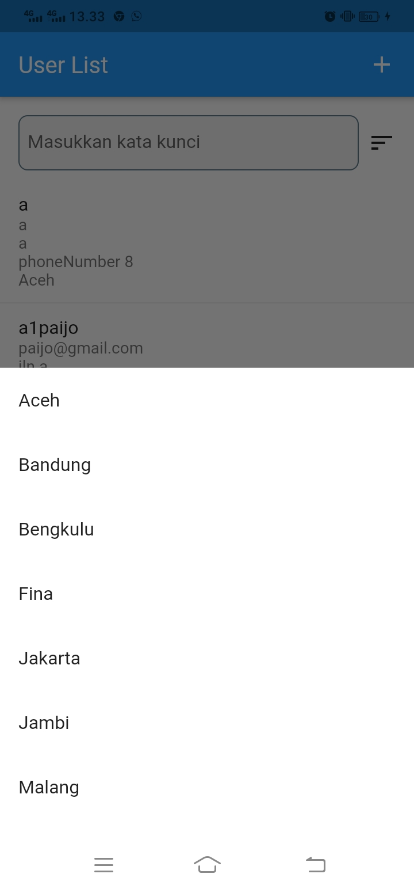
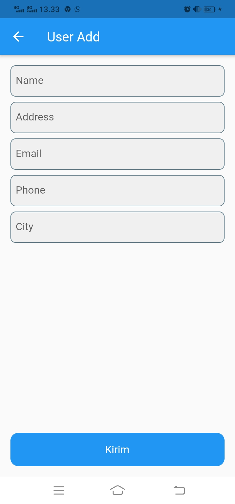

# cpssoft_test

A new Flutter project.

# Cara Penggunaan Aplikasi

- Saat pertama kali memulai aplikasi, maka akan muncul list user
- Pada halaman ini juga tersedia form pencarian berdasarkan nama user
  
- Lalu di sebelah kanan form tersebut terdapat tombol filter yang akan menampilkan list kota, yang mana saat salah satu kota tersebut diklik, maka list user akan otomatis diurutkan berdasarkan kota.
- Selain itu juga disudut kanan atas terdapat tombol tambah yg mengantarkan anda pada halaman User Add
  
- Pada menu ini, Anda dapat menambah list user berdasarkan data yg anda iputkan
- Semua field wajib untuk diisi
- Jika sudah lengkap makan tekan tombol kirim, dan user list akan bertambah

# Teknologi yang digunakan

- Flutter 2.2.3
- Bloc as StateManagement
- GetX as Route and Navigation
- Get_it as Dependency Injection

# Alasan tampilan

- Sederhana & Mudah dipahami
